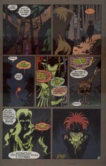

# The Annotated Sandman

## Issue 66: "The Kindly Ones: 10"

> [!THUMBNAIL] 

##### Neil Gaiman, Marc Hempel, Richard Case

### Page 1

> [!THUMBNAIL] 

- #### Panel 1

  Snap!

- #### Panel 7

  Puck is quoting Yeats' "The Second Coming". Strictly speaking, that should be "loosed", not "loose". Here and on the next few pages his speech seems to waver between prose and blank verse.

### Page 2

> [!THUMBNAIL] 

- #### Panel 1

  Note how Daniel's eyes appear to glow. This is perhaps a symptom of his part-immortal nature; they did not when we saw him back in [issue #59](sandman.59.md).

- #### Panel 4

  **So the wolf...**: a quote from "The White Devil", act V scene 4. Daniel's eyes here especially resemble Dream's.

### Page 3

> [!THUMBNAIL] 

- #### Panel 1

  "The letters" are probably the two that the apostle Paul wrote, found in the New Testament of the Bible. "The pillars" are the most ornate of the various orders of Greek architecture; they are fluted, and decorated at the capital with carvings of acanthus leaves. "The leather" refers to car advertisements; in the late 1970s the ads for the Chrysler Cordoba featured the phrase "fine Corinthian leather". (I have heard that Corinth is not in fact known for leather, that the phrase was merely the brainchild of some advertising executive.) "The place" is the Greek city of Corinth, and also the isthmus upon which it is located, which connects the Greek mainland with the Peloponnesian peninsula. In ancient times the city was known as a place of immorality and luxury -- a Greek Las Vegas, if you like. "The mode of behavior" is thus (in the words of one dictionary) "that of a licentious libertine".

- #### Panel 4

  Notice that mouse that Puck was playing with; it is one-eyed.

### Page 4

> [!THUMBNAIL] 

- #### Panel 1

  ...And here is suddenly introduced one-eyed Odin, who was capable of shifting shape. Among the wisdom that he received for his eye was the knowledge of runic writing; and in some versions, foreknowledge of Ragnarok.

### Page 9

> [!THUMBNAIL] 

- #### Panel 1

  Each title page shows a dwelling-place. Here, Titania's castle.

- #### Panel 2

  "One must not offend against the notions of one's neighbors." This is a reference to James Branch Cabell's novel _The High Place_, where that very phrase was used many times.

### Page 10

> [!THUMBNAIL] 

- #### Panel 1

  The name "Menton" showed up in the background chatter when we first saw the Inn of Worlds' End ([51:6](sandman.51.md#page-6).6). There is no evidence connecting that Menton with this one, but then there is no evidence to the contrary.

- #### Panel 6

  **Silver apples of the moon**: a reference to "The Golden Apples of the Sun, the Silver Apples of the Moon", a poem by William Butler Yeats.

### Page 12

> [!THUMBNAIL] 

- #### Panel 5

  "Wonderer"? The word used by Shakespeare (in _A Midsummer Night's Dream_) is "wanderer"...

### Page 13

> [!THUMBNAIL] 

Puck mentions the phrase "jot nor tittle." This is a Biblical reference, from Matthew 5:18 -- "For verily I say unto you, Till heaven and earth pass, one jot or one tittle shall in no wise pass from the law, till all be fulfilled." This is one of Jesus' beatitudes; he is saying that although he has a new interpretation of the Old Testament, that he will not change any of the text.

"Jot"s and "tittles" are the smallest marks in writing; our word "iota" comes from the same source. Of course, Jesus then goes on to rearrange lots of jots and tittles in the Old Testament, but that's another story.

(If you didn't know, the beatitudes are those lines that start with "Blessed are the ..., for they ... .")

### Page 14

> [!THUMBNAIL] 

- #### Panel 1

  "Murder" is the collective noun for crows.

- #### Panel 2

  **These two have appeared twice before**: once in the last part of "Brief Lives" ([49:14](sandman.49.md#page-14).1) and once in [58:18](sandman.58.md#page-18).3-5. The rabbit was named Ruthven; we know nothing else about them.

- #### Panel 4

  Mervyn, as shown more clearly a few panels later, is wearing the uniform of a sergeant in the U.S. Marine Corps -- although the bow tie is likely non-regulation. The dialogue and action of the next few pages parodies the conventions of war movies.

### Page 15

> [!THUMBNAIL] 

- #### Panel 3

  As a rule, the military units in war movies are relentlessly ethnically diverse. Mervyn's seems to have a Pole, an Irishman, a Scotsman, a Jew, an Italian, and "the little Norwegian".

### Page 18

> [!THUMBNAIL] 

- #### Panel 1

  "The Wood Between the Worlds" was the name given to a realm connecting one world to another in _The Magician's Nephew_, by C.S. Lewis. There is also the early fantasy novel, _The Wood Beyond the World_, by William Morris.

- #### Panel 7

  "Pigsney" is a variety of flower, I believe.

### Page 19

> [!THUMBNAIL] 

- #### Panel 4

  The word is "sinople".

### Page 21

> [!THUMBNAIL] 

- #### Panel 2

  This woman's name, as we will find out shortly, is Celia Cripps; the aunt to whom she refers is very likely Ethel Cripps, former mistress of Roderick Burgess.

- #### Panel 3

  _Princess Daisy_ is a real novel, a best-seller in 1980.

  Rose's novel was written by Erasmus Fry. We first heard of him in [issue #17](sandman.17.md), "Calliope" -- it was he who captured the muse of that name and held her prisoner. The plot of the book as Rose describes it has obvious parallels to her situation.

- #### Panel 7

  Robert Aickman (1914-1981): author of, among others, _Painted Devils_, _Cold Hand in Mine_, and _The Story of our Inland Waterways_.

  His "strange stories" could be described as horror or dark fantasy. They didn't use shock or gore, though, but rather created a mood of the unusual and eerie. Shirley Jackson (1919-1965): best known for the novel _The Haunting of Hill House_ and the short story "The Lottery". _We Have Always Lived in the Castle_ concerns two girls who live alone and outcast after the death by poison of their parents; it has a similar concern for mood over thrill to Aickman's stories.

### Page 22

> [!THUMBNAIL] 

- #### Panel 1

  Someone very kindly sent me definitions for these from the OED, and with my usual deftness I have lost them. Anyone out there with an online OED care to send them again?

- #### Panel 2

  Tori Amos, whose mutual admiration with Neil Gaiman is well-known, has a song called "Cornflakes Girl" on her album "Under the Pink".

- #### Panel 4

  **Note the handwriting on the list of words**: the word "sinople" is identical to that on Delirium's slip of paper.

- #### Panel 5

  "Marks and Sparks" is a common nickname for "Marks and Spencer".

### Page 24

> [!THUMBNAIL] 

- #### Panel 5

  **Dirae**: a Latin name for the Furies.

## Credits

- Greg "elmo" Morrow (morrow@physics.rice.edu) created the Sandman Annotations.
- Originally collated and edited by David Goldfarb.
- Numerous people identified the song "Cornflakes Girl": Joe Brenner (doom@kzsu.Stanford.EDU), Glenn Carnagey (lf7z@midway.uchicago.edu), David W. James (vnend@princeton.edu), Bill Jennings (zenok13@uclink2. berkeley.edu), Greg Primm (primm@ibm.net), Christina Schulman (schulman+@pitt.edu), and Eric Tsai (juvenile@leland.Stanford.EDU).
- Katie Schwarz (katie@physics.berkeley.edu) gave the precise reference on the "White Devil" quote.
- Ralf Hildebrandt added more details.
