# The Annotated Sandman

## Issue 67: "The Kindly Ones: 11"

> [!THUMBNAIL] 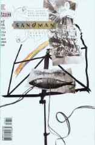

##### Neil Gaiman, Marc Hempel, Richard Case

**Cover**: Most of the things on this cover seem to be symbols of Delirium: the music-stand, very angular and linear, dissolving and twisting; the crayoned rainbow -- Del is frequently very colorful, both in speech balloons and in hairstyle, while the crayons represent her childishness; the fish, which she was being when we first saw her this arc; a picture of women being moonstruck (a traditional symbol of insanity). The cord is not a symbol of Delirium directly, but there have been a number of hints that Delirium is important to Dream's fate, which would explain why the fish is tangled up in it.

### Page 1

> [!THUMBNAIL] 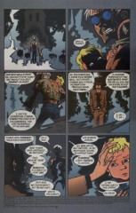

- #### Panel 1

  And for the first time we see an opening panel without a cord of some kind. Maybe it migrated to the cover out of pique at having been broken last issue.

- #### Panel 6

  In [issue 40](sandman.40.md), "The Parliament of Rooks".

### Page 2

> [!THUMBNAIL] 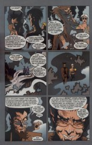

- #### Panel 3

  This statement about time seems a bit odd: in [64](sandman.64.md):20.2 Dream says it has been five days, and defeating Loki took only a short time after that. On the other hand, quite a bit more time has passed in the waking world since then. We don't know how long it took the Corinthian and Daniel to come from Swartalfheim to the Dreaming.

- #### Panel 5

  In "The Parliament of Rooks" Matthew accused Cain of sounding like Vincent Price. ([40:9](sandman.40.md#page-9).4) It's undeniable that this image of Cain is based on the way Vincent Price looks.

- #### Panel 6

  This story is based on a creation myth of the Chukchi people of Alaska. Originally, it concerned only Raven (a hero of their culture); Noah and the Ark were added on due to the influence of Christian missionaries.

### Page 3

> [!THUMBNAIL] 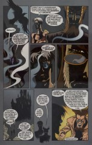

- #### Panel 2

  Along with some of his brother's stories, Cain seems to have acquired a slight stutter.

### Page 5

> [!THUMBNAIL] 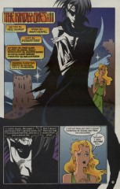

- #### Panel 1

  Here again we see a dwelling-place (Titania's castle) in the panel with the credits -- if only in the background.

### Page 6

> [!THUMBNAIL] 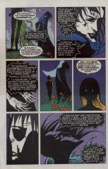

- #### Panel 7

  Dream's statement here is rather curious; on the one occasion that he spoke with Ishtar ([issue #45](sandman.45.md) -- "Brief Lives" part 5) the subject of change did not arise. He told Destruction that he had not changed, and a little bit later, Orpheus.

### Page 9

> [!THUMBNAIL] 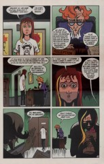

- #### Panel 1

  The image on Rose's t-shirt is television comedian Phil Silvers in his best-known role of Sgt. Bilko.

- #### Panel 2

  Given the time difference, Zelda would have died right about when Rose was meeting with Desire.

### Page 10

> [!THUMBNAIL] 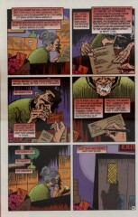

- #### Panel 1

  Rose, the receptionist from page 9, and Mrs. Burrows seem to be another maiden-mother-crone triad.

### Page 11

> [!THUMBNAIL] 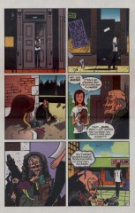

- #### Panel 2

  Note the "Gregory the Movie" sign. And another multiple of three in the other sign.

- #### Panel 5

  "Hostess" does not make mints, as far as I know -- only pastries of one sort or another. The thin green package resembles that of Nabisco Thin Mints.

- #### Panel 6

  It's the return of Barnabas, last seen in [issue #49](sandman.49.md). Note also the "57 Flavors" that Lyta, Carla, and Daniel went to at the start of the story.

### Page 13

> [!THUMBNAIL] 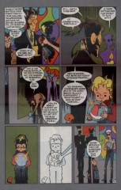

- #### Panel 4

  Most likely this is the orb that Dream used to communicate with Matthew and the Corinthian back in [64](sandman.64.md):20.1.

### Page 16

> [!THUMBNAIL] 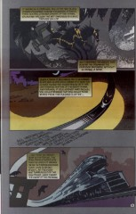

- #### Panel 2

  This may well be the same train that took Robert from his city into his city's dream, in the story told in [issue #51](sandman.51.md). If nothing else, it is certainly an echo thereof.

### Page 18

> [!THUMBNAIL] 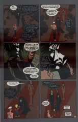

- #### Panel 6

  Dream and Lucien turn and look directly at the reader, but are actually looking at a female observer; this would seem to be an echo of the end of Rose's dream in "The Doll's House" part 1 ([10:14](sandman.10.md#page-14).6).

### Page 19

> [!THUMBNAIL] 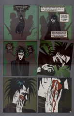

- #### Panel 4

  Note that Dream is struck on the same cheek, in roughly the same place, where Nuala kissed him.

- #### Panel 5

  Several people commented that this bloodstain is shaped a little bit like a heart.

### Page 23

> [!THUMBNAIL] 

Panels 1-3 echo in layout, form, and action, page 23 of [issue #11](sandman.11.md) (part 2 of "The Doll's House").

### Page 24

> [!THUMBNAIL] 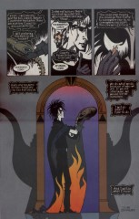

This page similarly echoes [11:24](sandman.11.md#page-24).

- #### Panel 2

  As we know from the annotations to [issue #17](sandman.17.md), "Eagle Stones" were found in eagle's nests and were required for the hatching of their eggs. The main character in that story, Ric Madoc, wrote a novel with that title.

## Credits

- Greg "elmo" Morrow (morrow@physics.rice.edu) created the Sandman Annotations.
- Originally collated and edited by David Goldfarb.
- Katie Schwarz (katie@physics.berkeley.edu) referenced the creation myth; Matthew F. Johnson (ac867@Freenet.carleton.ca) added detail.
- "Raven" (pl11@cornell.edu) identified the crystal ball.
- Joe Brenner (doom@kzsu.Stanford.EDU) identified Phil Silvers.
- Dexter Peterson (petersod@river.it.gvsu.edu) noted the echo of Rose's dream.
