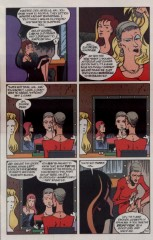
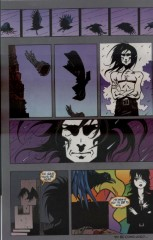

> [marginThumb] 

## Issue 68: "The Kindly Ones: 12"

##### Neil Gaiman, Marc Hempel, Richard Case

### Page 1

> [marginThumb] 

- #### Panel 2

  Notice that Daniel is playing with Barbie's old toys from A Game of You: Luz, Wilkinson, and Martin Tenbones.

### Page 2

> [marginThumb] 

- #### Panel 5

  Alianore (as long-time readers will remember) is an old lover of Dream's who came to a bad end, although the details are obscure.

- #### Panel 6

  We've seen the destruction of the Ruby and the Rose-Quartz; in [7](sandman.07.md):17.9 and [36](sandman.36.md):26.2, respectively.

### Page 4

> [marginThumb] 

- #### Panel 5

  Probably referring to the gathering in part 1 of "The Season of Mists". ([22:8](sandman.22.md#page-8).2)

### Page 7

> [marginThumb] 

- #### Panel 1

  Mazikeen's speech impediments seem to have gotten worse since the last time she had a line. She's saying, "Go away".

- #### Panel 2

  "If you don't go away, I will call the police." "Go away."

- #### Panel 6

  "Go in then. He deserves you."

### Page 8

> [marginThumb] 

- #### Panel 3

  Mary Gentian gets around; we saw her first in upstate New York in [6:12-13](sandman.06.md#page-12-13); then again in New York City in "A Game of You" part 6 ([37:12](sandman.37.md#page-12).8). She may also have been the newscaster on the nighttime news in [58:1](sandman.58.md#page-1).5. She is named for British fantasy writer Mary Gentle, just by the by.

### Page 10

> [marginThumb] 

- #### Panel 5

  HIV can be transmitted when users of intravenously injected drugs share hypodermic needles. Cleaning the needles with bleach kills the virus. Hal is implying that that's how Chantal and Zelda contracted AIDS.

### Page 11

> [marginThumb] 

- #### Panels 4-5:

  "The Kindly Ones" has gone on so long that it's started echoing itself. These two panels echo part of Remiel's meeting with Lucifer, [60:4](sandman.60.md#panel-4).6-7.

- #### Panel 5

  Hal is referring to a fashion theory that classifies people into four types associated with the seasons. Each type is meant to look good in certain colors and bad in others. Note Hal's "Gregory" t-shirt.

### Page 12

> [marginThumb] 

- #### Panel 1

  This appears to be the place where Morpheus brought Rose Walker to kill her, in "The Doll's House" part 6 ([15:22](sandman.15.md#page-22).5).

### Page 13

> [marginThumb] 

- #### Panel 3

  Lucifer is quoting Edgar Allen Poe's poem "The Raven". The poem completes the line:

  > "...nevermore."

  Delirium, on the other hand, is (intentionally or not) quoting Matthew the raven, who has been saying, "What*ev*er" all through the story (most recently on the page immediately preceding).

- #### Panel 5

  "Los Angeles" is Spanish for "the angels" (the name is actually a shortened version -- originally it was something like "City of Mary, Queen of the Angels") and the city is often known by the nickname Lucifer gives it. No doubt he appreciates the irony involved in the erstwhile devil running a night club in the city of angels.

### Page 14

> [marginThumb] 

- #### Panel 3

  In "The Season of Mists" part 2 ([23:20](sandman.23.md#page-19-20).3-5).

### Page 20

> [marginThumb] 

- #### Panel 2

  Death proposed borrowing a book from Lucien in "Brief Lives" part 6 ([46:19](sandman.46.md#page-19).2).

- #### Panel 3

  Hope Mirrlees is a British writer of the early 20th century, best known for her fantasy novel _Lud-in-the-Mist_. _A Fly in Amber_ is subtitled, _being an extravagant biography of the romantic antiquary Sir Robert Bruce Cotton_.

### Page 24

> [marginThumb] 

- #### Panels 1-6:

  This sequence echoes a similar filmstrip-like one in "The Doll's House" part 2 ([11:16-17](sandman.11.md#page-16-17)).

## Credits

- Greg "elmo" Morrow (morrow@physics.rice.edu) created the Sandman Annotations.
- Originally collated and edited by David Goldfarb.
- Katie Schwarz (katie@physics.berkeley.edu) pointed out the echo in
- Matthew's flight on page 24, and noted Mary Gentian's appearances.
- Philippe Crocy (crocy@ens.ens.fr) pointed out the echo of Remiel's meeting in Rose's.
