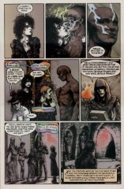
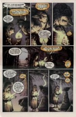
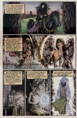

> [marginThumb] 

# Issue 70: "Which Occurs in the Wake of What Has Gone Before"

##### Neil Gaiman, Michael Zulli

### Page 1

> [marginThumb] 

- #### Panel 1

  Each of the Endless receives a messenger appropriate to their nature, although it is not quite clear why Destiny should receive a dove. If Destruction received a messenger, it would of course be a hawk, to reflect Destruction's warlike nature. Destruction also embodies change, while Destiny is stasis; perhaps that is why Destiny's messenger carries an opposite symbolism to Destruction's.

- #### Panel 4

  Notice that the first painting in the gallery is a mirror. We've seen before that the gallery of each Endless has a mirror where their own sigil would be.

### Page 2

> [marginThumb] 

- #### Panel 2

  As seen previously, the frames here are views through mirrors, which is why we see Destiny in one here. It may be that Destiny, whose nature precludes hope, can be viewed as despairing. The black-framed picture is reportedly a self-portrait of Zulli.

### Page 3

> [marginThumb] 

- #### Panel 2

  Death's messenger is a harpy eagle, a bird of prey -- possibly also an eater of carrion?

- #### Panel 4

  These are the kind of parakeet known as "lovebird".

### Page 4

> [marginThumb] 

- #### Panel 1

  We've heard the true version of this rhyme in "The Parliament of Rooks": 40:7.3-4. Delirium's messenger would seem to have been a magpie.

- #### Panel 3

  For more information on this necropolis, consult [issue #55](sandman.55.md).

### Page 7

> [marginThumb] 

- #### Panel 2

  Of course, the others have to explain to Despair what must be done, as she is the only one who hasn't done this before.

- #### Panel 6

  Naturally, it is Desire who creates the _heart_...

- #### Panel 7

  ...But it is not known why Despair should create the eyes. Perhaps because she skewers her own eye in the Brief Lives arc? ([41:20.5](sandman.41.md#page-20))

- #### Panel 8

  Note that Destiny's book has a miniature version of this very panel.

### Page 8

> [marginThumb] 

- #### Panel 2

  And of course, it is _Death_ that gives the envoy _life_.

- #### Panel 4

  The name "Eblis" derives from Arabic myth. Eblis was a spirit of fire, to be the head of angels (he is referred to in Sura 18 of the Qu'ran).

  When Eblis refused to bow to Adam (because Adam was made of clay), God cast him out of heaven. Eblis then vowed to seduce man to forsake God. Thus he became Satan or the Devil. We can compare this to Lucifer Morningstar in the Christian religion.

  "O'Shaughnessy" derives from Arthur W. E. O'Shaughnessy, a mid-19th- century poet. Most of his work is deservedly obscure, but one poem, entitled "Ode", has achieved a modest fame. Its theme is that art and dreams shape the world, and that poets and musicians are the world's true kings. It has thus been understandably popular with poets and musicians, and has been set to music several times.

- #### Panel 7

  "Creature" in its literal meaning of "created thing".

### Page 9

> [marginThumb] 

- #### Panel 1

  The same question was asked of Mistress Veltis when she entered the same room, in "[Cerements](sandman.55.md)". Also, the room was described as having "six silver cerements" hanging from the walls.

  Coupled with Eblis' answer to the voice, this leads me to believe that each cerement is meant for one of the seven Endless.

  Possibilities for who the missing _seventh_ cerement is meant for, (and reasons against):

  - Death: she is supposed to be the last of the Endless to leave the universe, ([#20, page 20](sandman.20.md#page-20), panel 6, among others), and so cannot die. (But we have not been explicitly told she can't die.)

  - Despair: Despair was killed at one point. (But there is no reason why she can't die again.)

  - Destruction: he has "given up" his job as an Endless, and so isn't permitted a funeral with the required cerement. (But just because Destruction has "given up", doesn't mean that he has stopped being an Endless.)

### Page 10

> [marginThumb] 

- #### Panel 4

  The image at top right is Edvard Munch's well-known "The Scream"; the one in the middle is William Blake's "Ancient of Days". The leftmost picture must have relevance too, if that can be identified.

  > [flex cols-2]  

### Page 11

> [marginThumb] 

- #### Panel 2

  The contracts were amended, presumably when Dream borrowed them in [Perfect Hosts](sandman.02.md)

- #### Panel 3

  Note that the pictures have changed, or we're seeing different pictures on an adjacent wall; these seem to depict Egyptian funeral customs. Which ties in with the Egyptian sphinxes on either side of Dream's throne.

### Page 12

> [marginThumb] 

- #### Panel 7

  In the [Season of Mists Epilogue](sandman.21.md) page 11, Dream was described as "accumulating names to himself, like others make friends." Here, however, the new Dream refuses to be called "Morpheus". Yet another difference between the old and new Dreams.

### Page 13

> [marginThumb] 

- Note that there is no page number.

Note how Eve gets progressively younger. We've seen this happen before in [Season of Mists #3, page 18](sandman.24.md#page-18) and [The Kindly Ones #1](sandman.57.md) page 16.

- #### Panel 1

  "In aeternum" simply means "in eternity", or possibly "into eternity".

### Page 14

> [marginThumb] 

- And now Eve grows older again. Eve's age seems to be eternally in flux. (Although Cain and Abel both seem to stay the same age. But then again, in A Parliament of Rooks, we were told that Eve wasn't Cain's mother.)

  Thomas Wilde @ tvs_wanderer@yahoo.com:

  > Judging from both "A Parliament of Rooks" and this, Eve would seem to be some kind of abstract representation of the Triple Goddess spoken of in a number of pagan cultures. It's worth mentioning that by Gaiman's weird cosmology, and from the art from the Biblical story told in "Parliament", the Eve in the Dreaming seems to change from the unnamed woman driven away by Adam, to Lilith, to Eve herself... from Maiden, to Mother, to Crone. Then again, aren't all the creatures of the Dreaming abstract representations, _but_ Abel and Cain? Eve isn't their mother because (maybe) she just wears their mother's shape.

### Page 15

> [marginThumb] 

- #### Panel 2

  There was a legend in medieval times that toads had jewels embedded in their skulls; this was a morality fable of beauty in ugliness.

- #### Panel 6

  Richard Madoc was last seen in Calliope, ([Sandman #17](sandman.17.md)). Note that he wears gloves, and is now in a nursing home. (See "Calliope" for the reason why.)

### Page 16

> [marginThumb] 

- #### Panel 1

  Note that the griffon is missing from the left of the main entrance, and that the wyvern has taken its place.

### Page 17

> [marginThumb] 

- #### Panel 6

  The man with the swan wing appears to be the same one that appeared in the Kindly Ones, whom Dream talked to. (see [#64, page 5](sandman.64.md#page-5))

### Page 18

> [marginThumb] 

- #### Panel 3

  The ring was given to Alex by Rose Walker in [The Kindly Ones #6](sandman.62.md).

### Page 18

> [marginThumb] 

- #### Panel 5

  Audrey was Hob Gadling's last wife/SO. Hob visits her grave in [The Kindly Ones #3](sandman.59.md).

### Page 20

> [marginThumb] 

- #### Panel 1

  Note that the figures in the windows represent the dreams that we've seen Dream recreate: from right to left, Mervyn's pumpkin, Abel's boots, and Gilbert's flowers.

### Page 21

> [marginThumb] 

- #### Panel 2

  "Duma's feet may, or may not, quite touch the ground." Possibly as a result of having been corrupted. [See [60:1](sandman.60.md#page-1)]

### Page 22

> [marginThumb] 

- #### Panel 1

  Note Titania arriving at the top of the stairs.

### Page 23

> [marginThumb] 

- #### Panel 1

  Alex Burgess is quoting the page from the _Liber Paginarum Fulvarum_ describing Morpheus. In issue [#1](sandman.01.md) he was shown reading that page over and over. Note the Siamese cat on the rocks, probably the cat-prophet from "[Dream of a Thousand Cats](sandman.18.md)"; also the figure with the staff further up the stairs, who is quite possibly Odin.

## Credits

- Greg "elmo" Morrow (morrow@physics.rice.edu) created the Sandman Annotations.
- Originally collated and edited by David Goldfarb.
- Carl Fink (carlf@panix.com) noted the panel in Destiny's book, the pictures of Egyptian funerals, the lack of a page number on page 13, and pointed out the cat and Odin.
- Kevin Meehan (kevinm@acy1.digex.net) referenced Eblis; so did Jess Nevins (jnevins@bgsuvax.bgsu.edu) and Brian Roe (bar1@cornell.edu).
- Marc Singer (marcs@wam.umd.edu) noted the Blake picture.
- Amy Borden (borden@alexia.lis.uiuc.edu) identified Death's messenger.
- Timothy Hock Seng Tan <083285@bud.cc.swin.edu.au>
- Ralf Hildebrandt added more details.
- Richard Munn added details too.
