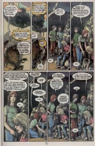

# The Annotated Sandman

## Issue 71: "In Which a Wake is Held"

> [!THUMBNAIL] 

##### Neil Gaiman, Michael Zulli

### Page 1

> [!THUMBNAIL] 

- #### Panel 3

  The man with the jacket and glasses sixth from the left resembles Neil Gaiman. The odd-looking being eighth from the left may be J'onn J'onnz, the Martian Manhunter, in his (retconned) natural form.

- #### Panel 4

  The woman at the left resembles the character "Mercy", from _The Last Temptation_, which Gaiman also did with Zulli. The man and woman at front and center may be the two who served the banquet in "The Season of Mists" part 5 ([26](sandman.26.md):8.4 and [26:12](sandman.26.md#page-12).6).

### Page 2

> [!THUMBNAIL] 

- #### Panel 1

  The shadowed man at the far left may be intended to be Zulli.

- #### Panel 5

  This echoes "A Game of You" part 2 ([issue #33](sandman.33.md)), in which people's tears were drawn in black, giving an impression that their eyes had been pecked out.

### Page 3

> [!THUMBNAIL] 

- #### Panel 1

  The man in black is probably the Corinthian. The man in the turban is named Tamaris; he and the woman beside him served food to Dream and Delirium in "Brief Lives" part 2. ([42:13-14](sandman.42.md#page-13)) The rabbit is named Ruthven, and his lady is similarly unnamed. We've seen them a few times before, most recently dead at the Furies' hands in [66:14](sandman.66.md#page-14).2.

- #### Panel 2

  The woman on the broom is known as the Fashion Thing, and was seen most recently in "The Season of Mists" part 1. ([22:3](sandman.22.md#page-3).4)

### Page 5

> [!THUMBNAIL] 

- #### Panel 1

  This seems to be a gathering of four of Dream's old loves: Calliope, the Thessalian witch, reincarnated Nada, and Queen Titania.

### Page 7

> [!THUMBNAIL] 

- #### Panel 3

  It's not clear who this is; the most likely candidate is Eric Needham, who once offered Lyta Hall a job. He was last seen in [59:18](sandman.59.md#page-18).6.

### Page 10

> [!THUMBNAIL] 

- #### Panel 1

  Mad Hettie was last seen in this series in [3:5](sandman.03.md#page-5).4, although she played a major role in the _Death; The High Cost of Living_ miniseries.

### Page 13

> [!THUMBNAIL] 

- #### Panel 1

  Liar.

- #### Panel 7

  The fiddler is Abudah, last seen being killed with Mervyn Pumpkinhead in [66](sandman.66.md):16.6.

### Page 15

> [!THUMBNAIL] 

- #### Panel 5

  Readers of Alan Moore's _Swamp Thing_ know that when Matthew was a man he was possessed of immense power. (Non-readers of Alan Moore's _Swamp Thing_ are missing out big-time.)

### Page 16

> [!THUMBNAIL] 

- #### Panel 6

  According to Brewer's _Dictionary of Phrase and Fable_, the Arimaspians were a race of men at war with a race of gryphons. Creating a land with that name is probably Gaiman's invention.

### Page 17

> [!THUMBNAIL] 

- #### Panel 3

  Rose's brother Jed was last seen at the end of "The Doll's House". ([16:20](sandman.16.md#page-20).8) His appearance here seems reminiscent of Shaggy in the cartoon series "Scooby Doo", although this may not be intentional.

### Page 18

> [!THUMBNAIL] 

- #### Panel 4

  See the '70s Jack Kirby _Sandman_ series and part 3 of "The Doll's House" ([issue #12](sandman.12.md)) for details.

### Page 19

> [!THUMBNAIL] 

- #### Panel 3

  The Bhartari Raja was last seen in issue 53. "Silas Tomken Cumberbatch" was an alias used by the poet Samuel Taylor Coleridge (note the initials). Winnie the Pooh did not use a false name, rather his house had a sign above the front door reading "Saunders". (Thus he "lived under the name".)

- #### Panel 4

  Lucien is quoting _Swamp Thing_ #26, written by Alan Moore. The man in question was Matthew himself, who had been driving drunk and crashed his car; ultimately he died of it and became Morpheus's raven.

### Page 20

> [!THUMBNAIL] 

- #### Panel 1

  Unlike other artists, Zulli seems to draw the Thessalian's glasses as having no prescription.

### Page 22

> [!THUMBNAIL] 

- #### Panel 1

  According to report, the artwork in this panel originally had a red cape peeping out from the back of Clark Kent's suit, and there were other heroes visible in the background. The editor of the Superman titles felt this was disrespectful and ordered it cropped.

  Clark Kent is referring to old stories that are now no longer part of official continuity. In the 1970s, Superman's secret identity was a TV news anchorman rather than a newspaper reporter. The story where Superman got an ant's head was _Action Comics_ #296, and where he became a gorilla was possibly _Action_ #218, and where he had to fly forwards in time was possibly _Action_ #387.

  Also, notice that Superman implies that that particular dream of his is recurring, corresponding to the two (or three?) versions of the Superman TV show, the most famous being the one starring George Reeves and the most recent being "Lois & Clark: The New Adventures of Superman" with Dean Cain.

  The green man with the blue cape is a superhero called the Martian Manhunter.

  He's the only one of the three who hasn't been portrayed by "an actor on a strange television version of (his) life". He was last seen in [5:14-15](sandman.05.md#page-14).

- #### Panel 2

  John Constantine was last seen in issue [#3](sandman.03.md); the man in the middle is probably Dr. Occult, and the man on the right is the Phantom Stranger. Neither of them have appeared before in this series, although they did have major roles in the _Books of Magic_ miniseries.

### Page 23

> [!THUMBNAIL] 

- #### Panel 4

  According to report, there is a proverbial phrase, "I'll wear a red dress at your funeral". The meaning of this phrase is not quite clear.

### Page 24

> [!THUMBNAIL] 

- #### Panel 5

  The statement that Matthew gives to Morpheus was in fact said by Mark Twain (the author of _Tom Sawyer_).

## Credits

- Greg "elmo" Morrow (morrow@physics.rice.edu) created the Sandman Annotations, and helped identify the Superman stories.
- Jack Grimes (LBMGMD@aol.com) also helped with them.
- Originally collated and edited by David Goldfarb.
- Katie Schwarz (katie@physics.berkeley.edu) identified various characters and looked up "Arimaspia".
- Rick Pim (rick@qucdnee.ee.queensu.ca) identified the origin of the Bhartari Raja's alias.
- Bill Jennings (zenok13@uclink2.berkeley.edu) mentioned the phrase about funerals and red dresses.
- Ralf Hildebrandt added some notes on the superhero conversation on p22.
