## Issue 72: "In Which We Wake"

> [!THUMBNAIL] 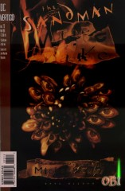

##### Neil Gaiman, Michael Zulli

As each member of Dream's family delivers their eulogy, notice how the flowers around the bier change (especially Delirium and her lawn flamingos!!)

### Page 1

> [!THUMBNAIL] 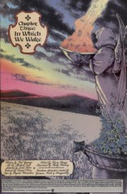

- #### Panel 1

  Note the blue roses here and later. Michael Zulli's contribution to the "Death Gallery" was captioned, "In Death's garden all the roses are blue."

### Page 2

> [!THUMBNAIL] 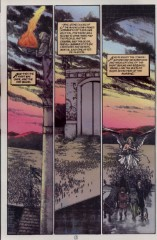

- #### Panel 3

  The beast on the left is the one which sent Brant Tucker off the road at the start of "Worlds' End". ([51](sandman.51.md):2.2) Note the Siamese cat at the lower right, perhaps the cat-prophet from "Dream of a Thousand Cats". And at the far right of the back row, hard to make out because of the shading, is Dave Sim's character Cerebus the Aardvark. (Delirium made a winged Cerebus in part 8 of "Brief Lives" ([48:15](sandman.48.md#page-15).5).)

### Page 3

> [!THUMBNAIL] 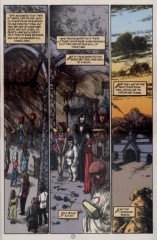

- #### Panel 5

  Further evidence for the theory that the current Destiny is not precisely the same personification (or 'point of view', as Cain aptly puts it) as the character from before the reality storm - 'But which book?'. Since it is entirely unnecessary, not to mention unGaiman, to include some form of hyperbolic 'da-da-da-DAH' dramatic effect in a mere reference to Destiny's book, which we've become familiar with, on and off, for the last nine books, and since there is no alternative book mentioned anywhere, I think this should be taken as a definite hint that the book is, this sentence has gone on far too long. I think you see what I'm getting at.

### Page 4

> [!THUMBNAIL] 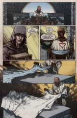

- #### Panel 2

  We see Destiny's eyes!

  Yet in one of the Brief Lives issues (i forget, they're in the car) they specifically say Destiny is blind and has no eyes.

  As a matter of fact we never see his eyes any time beyond this i think. What's going on here (I may seem to be a bit picky, but Destiny has always been my favorite character).

  When we see him actually, he seems well, young, sensitive, not innocent but not the fatalistic persona we usually see him as either. Now this may be the change in artistry we see so often and changes in personal types seen just as much, but whenever we HAVE seen him up close (Orpheus, Seasons of Mist Intro, Necropolis of Despair's and Brief Lives) he has remained the same. An old man with closed eyes, now this, once again, whats going on here?

  Matthew Noel's thoughts: It seems to me that the reality storm that took place with the conflicting Destiny's might have something to do with this. In the Kindly Ones, when all the Destiny's come together or cease to exist or whatever, the annotations mention certain things about whether the Destiny who now exists is in fact the original that we all knew and loved. For instance, there was talk about the scene of the new Dream facing the Corinthian with the blood on his throne, and how it was deliberately drawn differently than it was when Destiny saw it in his book. In the annotations, there is mention that perhaps this is because this Destiny that we now see may not be the same as before.

  Well, this would seem to continue to work with this new view of Destiny. Perhaps the Destiny that remained after the reality storm is a younger Destiny who is maybe warmer (I don't know about anybody else, but it always seemed to me that the 'regular' Destiny seemed to take some enjoyment in telling people, specifically Dream, things about his destiny that he didn't really want to know... while this Destiny seems at least a bit sad for his brother...), younger (the new Dream would affect anything that could dream, right? Maybe that gives the whole universe a fresher look at their lives and destiny?), and one who has eyes that could see (also an effect of a new Dream, perhaps?).

  Interesting on the Dialogue of the Family while others are waking Death says it's not for eating its a table decoration, and earlier Mathew said that's what the all the food is there for.

### Page 5

> [!THUMBNAIL] 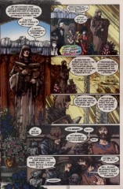

- #### Panel 1

  The flowers here appear to be calla lilies (or perhaps spathiphyllum [peace lilies]), hydrangea, digitalis (foxglove), and roses.

- #### Panel 5

  The goat-headed fay on the left is called Skarrow, and last appeared in "A Midsummer Night's Dream". (19:passim) The being between Mad Hettie and Hob Gadling is probably the Borghal Rantipole, last seen in that form in [66](sandman.66.md):20.3.

### Page 6

> [!THUMBNAIL] 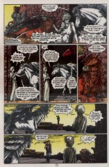

- #### Panel 6

  Long-time readers will of course recognize Dream's absent brother Destruction, last seen in part 8 of "Brief Lives" ([48:23](sandman.48.md#page-23).3).

### Page 7

> [!THUMBNAIL] 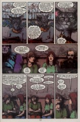

- #### Panel 4

  Sitting at the left is Darkseid, a major villain of the mainstream DC Universe. At far right is the Emperor Norton, last seen in [issue #31](sandman.31.md). At the time this issue came out, both of these entities were dead, although Norton rather more permanently so.

### Page 9

> [!THUMBNAIL] 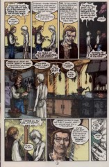

- #### Panel 3

  Cheshire is the most popular cheese historically in England. It's also the oldest. It's very salty after a brief exposure, though one tends not to notice at first. It's a member of the cheddar family, but it can't really be made outside Chester county in England because of the high salt content in the soil there.

  Wensleydale is a blue veined, rich cream cheese. It has perhaps the best aftertaste of any cheese. Neither of the cheeses looks like the wheel in Destruction's hand.

### Page 11

> [!THUMBNAIL] 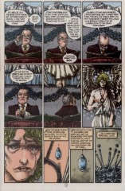

- #### Panel 1

  Wesley Dodds was the superhero known as "The Sandman". In the real world, he was the first character to bear that name. He has appeared once before in this series, in [1:18](sandman.01.md#page-18).4-6. The meeting he refers to took place in the _Sandman Midnight Theatre_ special.

- #### Panel 2

  Dian Belmont was Wesley's lover. (Later his wife?)

### Page 14

> [!THUMBNAIL] 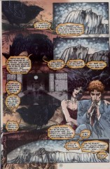

- Mazikeen has a heart tattooed on her left breast.

### Page 15

> [!THUMBNAIL] 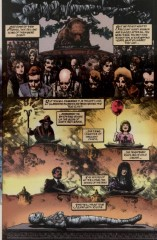

- #### Panel 1

  This is Leib-Olmai, the Alder Man, who became a bear to evade Dream and Delirium's search for Destruction. ([44](sandman.44.md):4.5) He was supposed to have been informed that it was safe to return. Perhaps he liked the bear-shape.

- #### Panel 2

  The boy in the front row, second from the right, resembles Steven, the protagonist of Gaiman and Zulli's _The Last Temptation_. The two men in the third row on the right-hand side are Zulli and Gaiman themselves.

- #### Panel 3

  The girl with the balloon is Shivering Jemmy of the Shallow Brigade, whom DC's "Lords of Chaos" sent to bargain with Dream for Hell in "The Season of Mists". She was last seen at the end of that story. (27: 21.5) Chaos's opponents, "The Lords of Order", also sent a representative; from the caption, he was meant to appear here, although Zulli did not draw him.

- #### Panel 4

  This is Faramond, who gave up being a Babylonian deity in favor of being a travel agent. He was last seen in "Brief Lives" part 6. (46:8.6)

- #### Panel 5

  This is Alianora, one of Dream's old lovers. The affair ended badly, although the exact details are not known. She was last seen at the end of "A Game of You" ([36:35](sandman.36.md#page-35).2).

### Page 17

> [!THUMBNAIL] 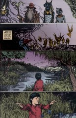

- #### Panel 4

  I believe the young oriental boy throwing the blue roses in honor of Dream's passing barge is actually the reincarnated Nada. The age is about right.

### Page 18-19

> [!THUMBNAIL] 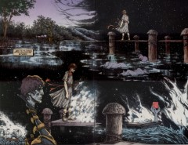

As Morpheus's funereal barge goes over the waterfall, the figurehead keeps changing. Notice when it becomes the hand holding the Ruby, it's being clutched very violently, reminiscent of the end of the Preludes and Nocturnes storyline when Dr. Dee crushed the Ruby with his bare hand, returning its power to Morpheus. In The Wake trade paperback, this sequence is expanded to stretch over three pages, and when that particular form of the barge is drawn, Zulli gave it two hands, and they're cradling the ruby much more gently. Also, in the trade, Zulli saw fit to include a version of the barge with Morpheus's visage as the figure head, with short hair, which appears between the Helm-barge and the Ruby-barge.

Perhaps these figureheads correspond to various important points in Morpheus's existence (his falling-out with Orpheus, his imprisonment, the destruction of the ruby and the beginning of this chronicle)?

### Page 21

> [!THUMBNAIL] 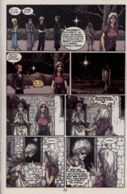

- #### Panel 1

  The man in the coat just to the left of Lyta Hall is Doctor Destiny, or Doctor Dee. He was last seen in [7:23](sandman.07.md#page-23).1.

- #### Panel 4

  The sequence that follows echoes the one at the end of issue 1 ([1](sandman.01.md):34-37), with reversals that work on numerous levels. This Dream gives mercy instead of punishment; the cat that Burgess follows is white instead of black; we go from the tower to the hallways instead of the other way around.

### Page 22

> [!THUMBNAIL] 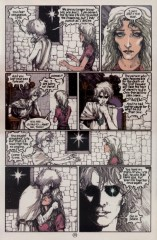

- #### Panel 6

  The placing of a mark on Lyta's forehead with a kiss recalls both God's mark on Cain (although again the intent is opposite) and Glinda the Good Witch's mark on Dorothy in _The Wizard of Oz_.

### Page 25

> [!THUMBNAIL] 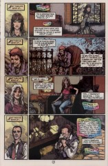

- #### Panel 2

  When Ric Madoc went to sleep ([70:15](sandman.70.md#page-15).6) the flowers around him were all blooming. Strange that they're now all dead.

### Page 26

> [!THUMBNAIL] 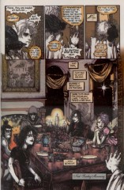

- #### Panel 1

  Some people have expressed confusion over the phrase "all but one". That one is you, the reader.

- #### Panel 2

  It was the French. They used to say it when they had kings.

## Credits

- Greg "elmo" Morrow (morrow@physics.rice.edu) created the Sandman Annotations.
- Originally collated and edited by David Goldfarb.
- Additional material by Ralf Hildebrandt
- Carl Muckenhoupt (baf@tiac.net) noted the _Wizard of Oz_ resemblance.
- Tehshik Yoon (tyoon@scunix4.harvard.edu) identified the creature from "Worlds' End" and noticed Neil Gaiman in the audience.
- Katie Schwarz (katie@physics.berkeley.edu) noticed the cat-prophet.
- Simo Heiskanen (sheiskan@cc.helsinki.fi) noticed Cerebus.
- Michael Chary (mac7@po.CWRU.Edu) commented on the cheese.
- Steve Zwanger (szwanger@gnu.ai.mit.edu) identified the flowers.
- April LePaige (73654.2110@CompuServe.COM) also commented on them.
- Stuart Friedberg (stuartf@sequent.com) noticed the change in Ric Madoc's surroundings.
