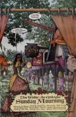
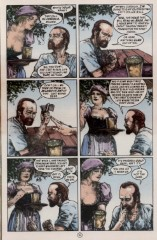

## Issue 73: "Sunday Mourning"

> [!THUMBNAIL] 

##### Neil Gaiman, Michael Zulli

### Page 1

> [!THUMBNAIL] 

- #### Panel 2

  On the off-chance that anyone is reading this story without knowledge of the rest of the _Sandman_ series, let me note that the man here is recurring character Robert "Hob" Gadling. He was born in the 14th century, and allowed by a whim of Dream and Death to live to the present day.

### Page 4

> [!THUMBNAIL] 

- The view shown is the entrance to the Minnesota Renaissance Festival held in Shakopee, Minnesota. According to report, Zulli visited it specifically to gather visual reference.

### Page 5

> [!THUMBNAIL] 

- #### Panel 1-3

  Of course, we know about all these other historical members of the Gadling "family".

### Page 6

> [!THUMBNAIL] 

- On the theme of "People must change", he we see Hob really has had plenty of time to reconsider his part in the past.

### Page 9

> [!THUMBNAIL] 

- #### Panel 7

  **Milton Keynes**: a "New City" in England built in the 1960s. Best known for having numerous (traffic circles) and [Concrete Cows](https://en.wikipedia.org/wiki/Concrete_Cows).

### Page 11

> [!THUMBNAIL] 

- #### Panel 1

  Gadling is punning on a line from Andrew Marvell's poem "To His Coy Mistress". The original has "love" rather than "lamb".

- #### Panel 2-3

  The bearded man seen in these two panels is noted fantasy writer (and friend of Gaiman's) Steven Brust. He was last seen at the Worlds' End Inn -- [56:9](sandman.56.md#page-9).7.

### Page 12

> [!THUMBNAIL] 

- #### Panel 6

  English beer is commonly served warm. English people commonly look down upon American beer.

### Page 16

> [!THUMBNAIL] 

- #### Panel 1

  According to report, Wild West shows are in fact quite popular in England, and have about the same degree of realism to them.

### Page 18

> [!THUMBNAIL] 

- #### Panel 3

  This is the ending of Kipling's poem "The Sack of the Gods". We know, of course, that at least some souls do reincarnate; Nada did at the end of "The Season of Mists", and if Gaiman follows Alan Moore's theology in _Swamp Thing_ Annual #2, then it's an option for blessed souls in Heaven.

### Page 22

> [!THUMBNAIL] 

- #### Panel 5

  The two women at the foreground right are The Fabulous Lorraine Garland and Emma Bull. The Fab. Lorraine is Gaiman's personal secretary; Emma Bull is a noted SF and fantasy writer. The two of them together compose the Flash Girls, a singing duo who have recorded several of Gaiman's songs.

### Page 24

> [!THUMBNAIL] 

- #### Panel 5

  Possibly echoing [6:4](sandman.06.md#page-4).1 -- "If you keep [stories] going long enough, they always end in death."

## Credits

- Greg "elmo" Morrow (morrow@physics.rice.edu) created the Sandman Annotations.
- Originally collated and edited by David Goldfarb.
- Jeremy Kulow (Jeremy.J.Kulow@uwrf.edu) confirmed the specific Renaissance festival used in the story, and its location.
- Richard Munn updated the entry on Milton Keynes.
