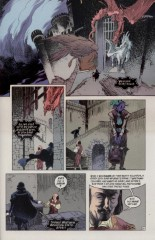

# The Annotated Sandman

## Issue 75: "The Tempest"

> [!THUMBNAIL] 

##### Neil Gaiman, Charles Vess

### Page 31

> [!THUMBNAIL] 

- #### Panel 3

  This seventeenth century ancestor of Merv is named in the Companion as _Merrow Turniphead_.

## Credits

- Greg "elmo" Morrow created the Sandman Annotations.
- Originally collated and edited by Richard Munn.
