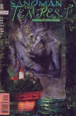
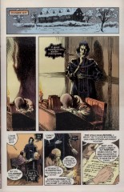

# The Annotated Sandman

## Issue 75: "The Tempest"

> [!THUMBNAIL] 

##### Neil Gaiman, Charles Vess

Note: The full script to this issue was published in The Deluxe Edition book five. I'll try to add any interesting details.

### Page 1

> [!THUMBNAIL] 

- #### Panel 1

  ACT I Scene 1

### Page 5

> [!THUMBNAIL] 

- #### Panel 2, 4

  In the script, Shakespeare is described as having an oilcloth over his head "like someone about to run to their car from a supermarket would raise a blanket or even a big newspaper over their head."

- #### Panel 4

  [New Place](https://en.wikipedia.org/wiki/New_Place), Shakespeare's home from 1615 until his death, was demolished out of spite in 1756. The site can be visited as a [tourist attraction](https://www.shakespeare.org.uk/visit/shakespeares-new-place/).

### Page 6

> [!THUMBNAIL] 

- #### Panel 1

  Shakespeare's local tavern here is run by Elizabeth Quiney, described in the script as "an elderly, very fat lady, red-cheeked and funny". She is aided by her son, [Tom Quiney](https://en.wikipedia.org/wiki/Thomas_Quiney) who in five years will go on to marry Judith. As mentioned later in the story, there was too much of his father in him, and Tom was cut out of Shakespeare's will after he got another woman pregnant.

  It is not clear whether this was an actual tavern, or was invented by Gaiman for the script.

### Page 7

> [!THUMBNAIL] 

- #### Panel 1

  Dickon here refers to Richard Quiney, her husband, and childhood friend of Shakespeare.

- #### Panel 2

  Shakespeare will on [page 19](#page-19).6 tell a different story of what Dickon was really up to in London...

### Page 9

> [!THUMBNAIL] 

- #### Panel 6

  **Rawhead** or **Bloody Bones**: a sixteenth century "bogeyman" figure.

  It's easy to miss, but in the background Shakespeare is quietly handing over his penny for the spectacle, despite saying "no" in panel 3.

### Page 10

> [!THUMBNAIL] 

- #### Panel 4-7

  The song sung by the drunken sailers is a song sung The Tempest (Act 2 Scene 2), so the suggestion here was it was an existing song, that Shakespeare used.

### Page 11

> [!THUMBNAIL] 

- #### Panel 1

  > ACT I Scene 2, Line 56

- #### Panel 4

> [!FLOATRIGHT_40PC] 

[Ben Jonson](https://en.wikipedia.org/wiki/Ben_Jonson) was a contemporary and a friend of Shakespeare who loved him and honored his memory as the star of poets but also criticized him for his lack of art and disregard for the Classical rules.

### Page 13

> [!THUMBNAIL] 

- #### Panel 3

  All these things seem to be historically true.

### Page 14

> [!THUMBNAIL] 

- #### Panel 4

  The **unfortunate affair** Ben is referring to is the [Gunpowder Plot](https://en.wikipedia.org/wiki/Gunpowder_Plot) of 1605, in which a group of Catholics tried (and failed) to assassinate King James I by blowing up the houses of parliament.

- #### Panel 5

  Ben was "involved" with the gunpowder plot. It seems he avoided punishment by "ratting out" his co-conspirators.

### Page 15

> [!THUMBNAIL] 

- #### Panel 2

  The joke here being that in the present day "Bonfire night" is still celebrated on the 5th of November every year. It is the main day in the UK that fireworks are let off, and many places organize large fireworks displays.

- #### Panel 3-4

  **"Remember, remember the fifth of November"** is a real poem, that is still recited as a nursery rhyme in present times. In reality it was written by John Milton in 1626.

### Page 16

> [!THUMBNAIL] 

- #### Panel 3

  > **Do you think of her ever** - figure out who Ben is referencing

### Page 17

> [!THUMBNAIL] 

- #### Panel 1

  Act I Scene 1 line 325.

- #### Panel 3

  The script here states _"Will cheerfully describes a scene he will never remember to write."_

### Page 19

> [!THUMBNAIL] 

- #### Panel 1-3

  Act I Scene 2 line 365.

- #### Panel 6

  Apparently nobody told his wife. £30 in 1600 is worth upwards of £4000 / $5000 at the time of writing.

  The request of £30 is preserved in [letters](https://shakespearedocumented.folger.edu/resource/document/only-surviving-letter-shakespeare-letter-richard-quiney-asking-shakespeares) from Quiney to Shakespeare.

### Page 20

> [!THUMBNAIL] 

- #### Panel 2

  **What win I, If I gain the think I seek..** - from the narrative poem [The Rape of Lucrece](https://en.wikipedia.org/wiki/The_Rape_of_Lucrece) by William Shakespeare, of course.

- #### Panel 7

  Act I Scene 2 line 437

### Page 21

> [!THUMBNAIL] 

- #### Panel 4

  The script here describes the background "transmuting into an island", which it seems wasn't kept for the final art. This makes it clear that Shakespeare is already dreaming at this point.

### Page 22

> [!THUMBNAIL] 

- #### Panel 3-4

  Here we see they are now on an island, but it's more of a sudden jump.

### Page 23

> [!THUMBNAIL] 

- Act 2 Scene 2 line 25

### Page 26-28

> [!THUMBNAIL] 

- Act 4 Scene 1

### Page 31

> [!THUMBNAIL] 

- #### Panel 3

  This seventeenth century version of Merv is named in the script as _Merrow Turniphead_.

## Page 32

> [!THUMBNAIL] 

- #### Panel 5

  This is a redrawing of [#13](sandman.13.md#page-12):12.3

## Page 34

> [!THUMBNAIL] 

- This page is supposed to mirror Hamnet's monologue from [#19](sandman.19.md#page-13):13

## Page 35

> [!THUMBNAIL] 

- #### Panel 3

  This refers to [Psalm 46](https://en.wikipedia.org/wiki/Psalm_46)

### Page 38

> [!THUMBNAIL] 

- #### Panels 1-8

  Act IV Scene 1 line 370

- #### Panel 9

  The points here are all true.

## Credits

- Greg "elmo" Morrow created the Sandman Annotations.
- Originally collated and edited by Richard Munn.
